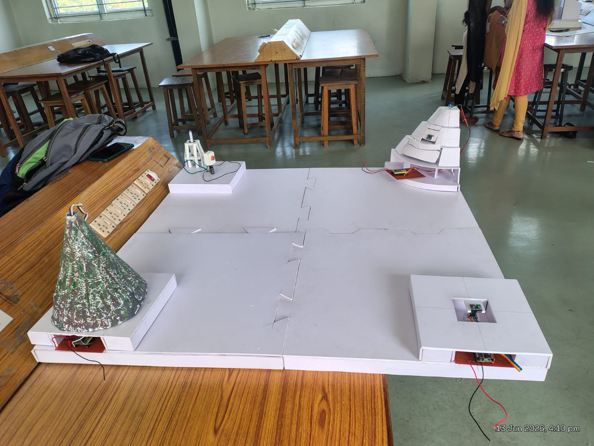
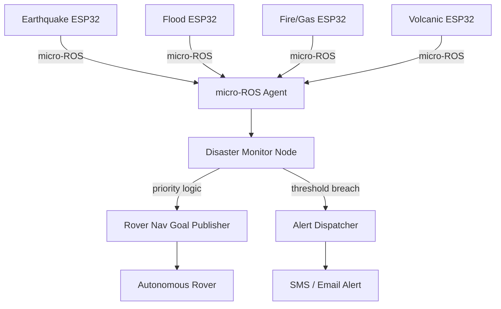
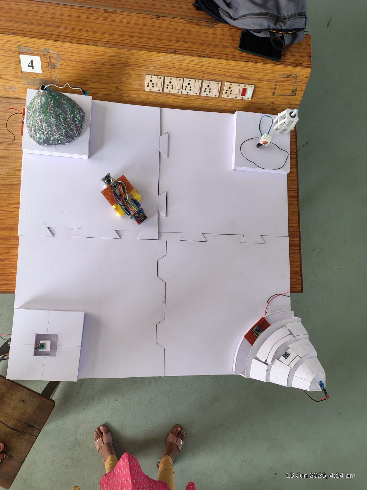
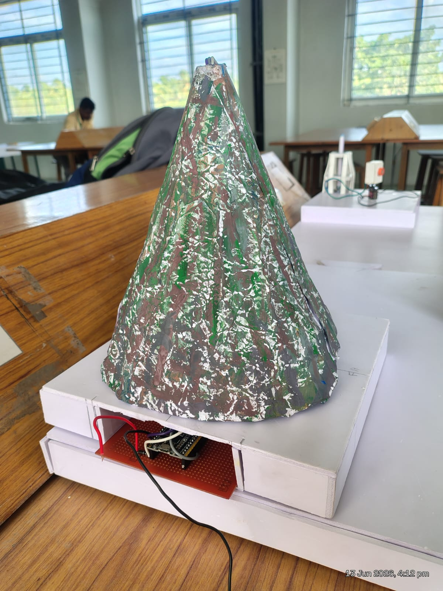
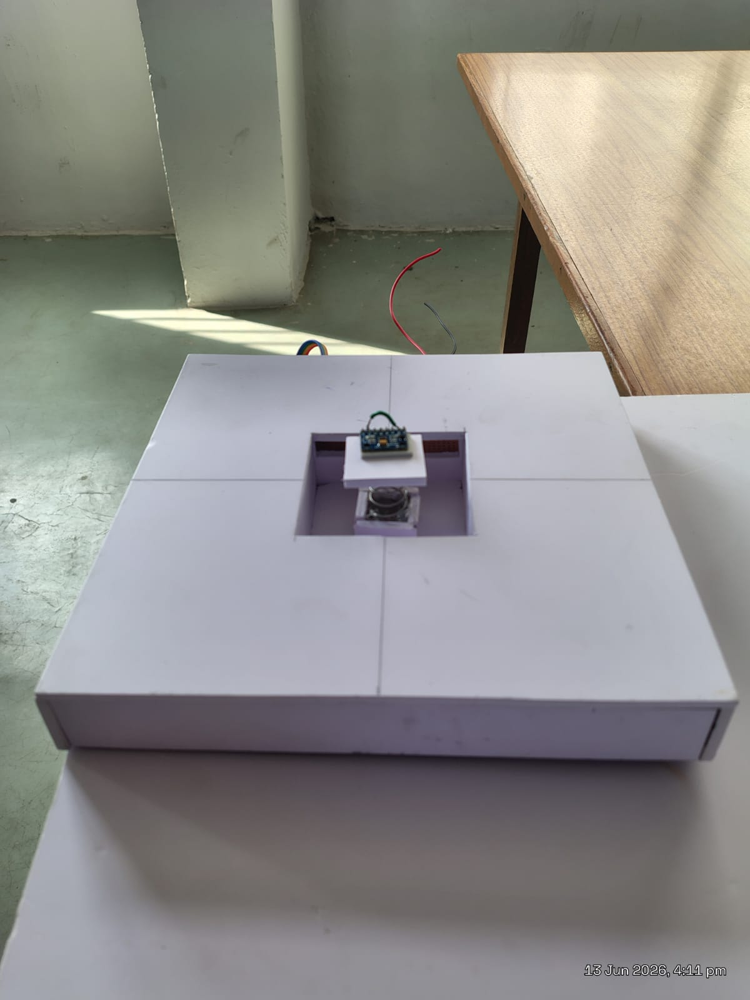
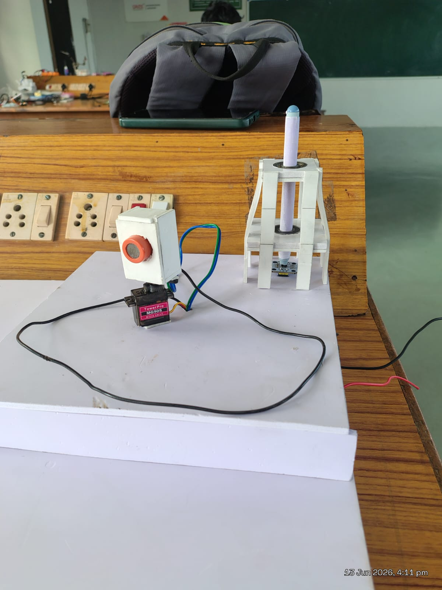
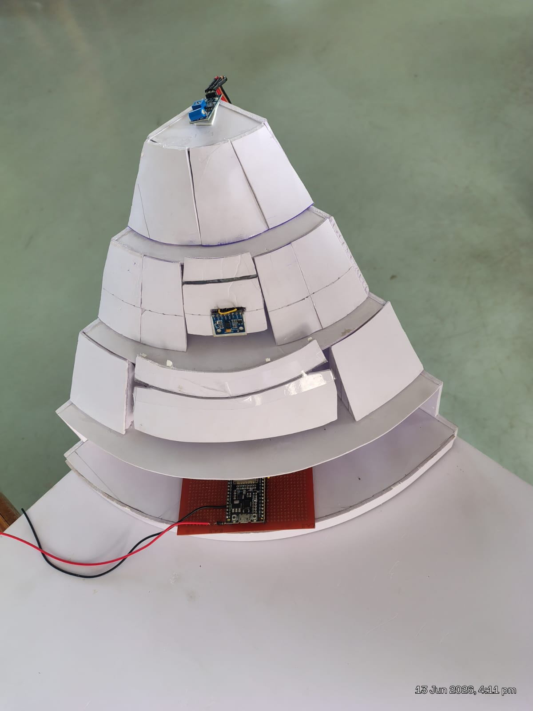

# RoboRelief — Autonomous Disaster Response Rover

## Overview
A ROS2-based autonomous disaster response system that simulates 4 real-world
disaster scenarios. Distributed ESP32 sensor nodes running micro-ROS publish
real-time sensor data to a Ubuntu ROS2 host. A priority logic node dispatches
an autonomous rover to the highest-severity disaster zone for on-site monitoring
and triggers alerts to emergency departments.

## Disaster Zones
| Zone | Physical Model | Sensor Used | ROS2 Topic |
|------|---------------|-------------|------------|
| Earthquake | Vibration platform | SW-420 vibration sensor | /earthquake/data |
| Flood | Multi-tier tower model | Ultrasonic / water sensor | /flood/level |
| Fire / Gas leak | MQ-2 box + flame sensor | MQ-2 + IR flame + servo | /fire/gas_level |
| Volcanic | Painted mountain model | Temperature + vibration | /volcano/data |

## System Architecture

## Demo Photos

### Full Arena — 4 Disaster Zones

### Flood Detection Tower

### Volcanic Hazard Model

### Earthquake Detection Node

### Fire and Gas Leak Detection

### landslide and angle detection

## Tech Stack
- **Firmware:** Arduino IDE + micro-ROS library on ESP32
- **Middleware:** ROS2 Humble on Ubuntu 22.04
- **Communication:** micro-ROS over WiFi UDP
- **Sensors:** SW-420, HC-SR04, MQ-2, IR Flame sensor, TowerPro MG90S servo
- **Languages:** C++ (ESP32 firmware), Python (ROS2 nodes)

## How to Run

### 1. Flash each ESP32 node
Open the respective folder in Arduino IDE and flash to your ESP32.
Configure WiFi credentials and micro-ROS agent IP in config.h

### 2. Start micro-ROS agent on Ubuntu
docker run -it --rm --net=host microros/micro-ros-agent:humble udp4 --port 8888
### 3. Launch ROS2 workspace
cd ros2_ws

colcon build

source install/setup.bash

ros2 launch disaster_monitor full_system.launch.py

## Project Structure
roborelief-disaster-rescue/

├── firmware/

│   ├── earthquake_node/

│   ├── flood_node/

│   ├── fire_gas_node/

│   ├── volcanic_node/

│   └── rover_firmware/

├── ros2_ws/src/

│   └── disaster_monitor/

├── media/images/

└── README.md

## Built By
**Ganesh Prabhu R**
B.E. Electronics and Communication Engineering
Karpagam College of Engineering, Coimbatore
[LinkedIn](https://www.linkedin.com/in/ganeshprabhu129/)
